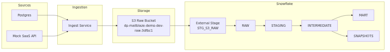
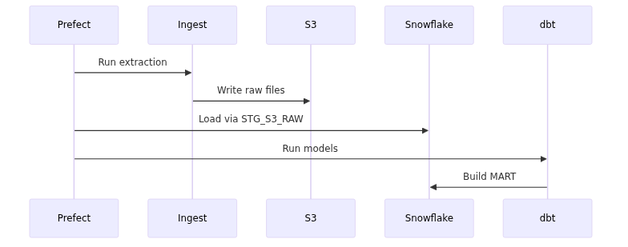
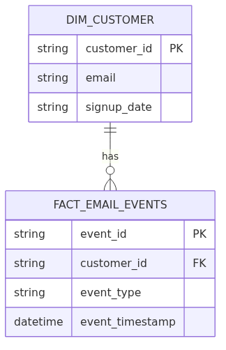
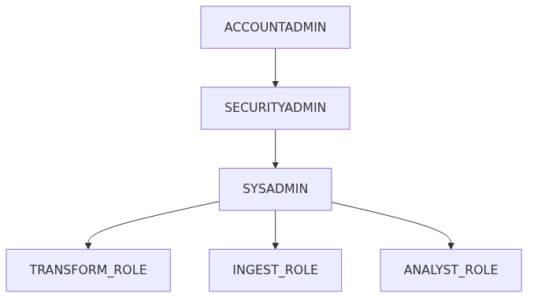

# Architecture Diagrams

This document contains rendered architecture diagrams for the project:

**Repository:** dp-mailblaze-demo 
**Flow:** dp-maiblaze-demo-dev-flow 
**Database:** DP_MAILBLAZE_DEMO_DEV_DB 

All diagrams are generated from Mermaid source files located in:

docs/diagrams/*.mmd

To regenerate diagrams:

```bash
./scripts/render_diagrams.sh
# 1. System Architecture

#2 Orchestration Sequence

#3 Start Schema (MART Layer)

#4 Snowflake RBAC Model

